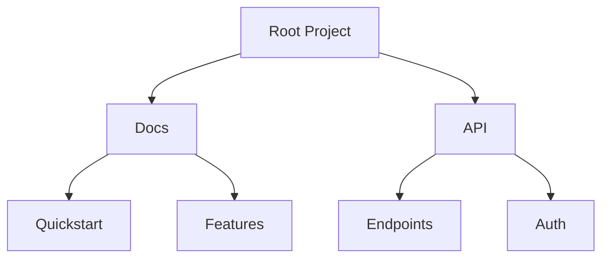

## Overview

Serhii Lukashov's documentation platform empowers you to manage projects efficiently with robust tools for organization, collaboration, search, and sharing. You create structured knowledge bases, invite team members, find information quickly, and distribute content seamlessly.

<Columns cols={2}>
  <Card title="Organize Documents" icon="folder" href="#document-organization">
    Build hierarchies and categorize content intuitively.
  </Card>
  <Card title="Collaborate" icon="users" href="#collaboration">
    Work together in real-time with version control.
  </Card>
  <Card title="Search & Filter" icon="search" href="#search">
    Locate exactly what you need with advanced queries.
  </Card>
  <Card title="Export & Share" icon="share-2" href="#export">
    Distribute docs in multiple formats effortlessly.
  </Card>
</Columns>

## Document Organization and Hierarchy

You structure your documentation using nested folders and pages, creating a clear hierarchy. Start with top-level projects, add subfolders for features or guides, and nest pages within them.



<Steps>
  <Step title="Create Folder" icon="folder-plus">
    Navigate to your project root and select `New Folder`. Name it descriptively, like `user-guides`.
  </Step>
  <Step title="Add Pages" icon="file-plus">
    Inside the folder, create pages with `New Page`. Use frontmatter for metadata:
    
````yaml
---
title: User Guide
tags: ["guide", "user"]
---
````
    
  </Step>
  <Step title="Reorder" icon="move">
    Drag and drop to adjust hierarchy. Changes save automatically.
  </Step>
</Steps>

<Callout kind="tip">
  Use consistent naming conventions, such as `verb-noun` (e.g., `setup-database`), for easy navigation.
</Callout>

## Project Collaboration Tools

Invite teammates to collaborate with granular permissions. You assign roles like Editor, Viewer, or Admin.

<Tabs>
  <Tab title="Real-time Editing" icon="edit-3">
    Multiple users edit simultaneously. Changes appear live with user indicators.
    
    <Image
      src="https://images.unsplash.com/photo-1517336714731-489689fd1ca8?w=800"
      alt="Real-time collaborative editing interface"
      width="800"
      height="400"
    />
  </Tab>
  <Tab title="Version History" icon="git-branch">
    Track changes with full history. Revert or compare versions:
    
````javascript
// Example API call to fetch history
fetch('https://api.example.com/docs/project/history', {
  headers: { Authorization: `Bearer ${YOUR_TOKEN}` }
})
  .then(res => res.json())
  .then(history => console.log(history.versions));
````
    
  </Tab>
  <Tab title="Comments & @Mentions" icon="message-circle">
    Add inline comments and @mention users for feedback.
  </Tab>
</Tabs>

## Search and Filtering Options

You search across all documents with full-text capabilities, filters by tags, dates, or authors.

<CodeGroup tabs="Basic,Advanced">
  ```javascript
  // Basic search query
  const results = await searchDocs("authentication setup");
  ```
  ```javascript
  // Advanced with filters
  const results = await searchDocs({
    query: "setup",
    tags: ["guide"],
    author: "serhii@example.com",
    dateFrom: "2024-01-01"
  });
  ```
</CodeGroup>

Filter results in the UI by selecting options like `Recent` or `By Tag`. Results update instantly.

| Filter Type | Description | Example |
|-------------|-------------|---------|
| Tags | Narrow by predefined labels | `guide`, `api` |
| Date Range | Find docs from specific periods | Last 30 days |
| Author | Content by specific users | serhii@lukashov.com |

## Export and Sharing Functionalities

Export docs to PDF, Markdown, or HTML. Share via public links with expiration.

<ExpandableGroup>
  <Expandable title="Export to PDF" default-open="true">
    Select a folder, choose `Export > PDF`. Customize with cover pages or watermarks.
  </Expandable>
  <Expandable title="Generate Share Link">
    Right-click a page > `Share`. Set permissions: view-only or edit.
    
````bash
# CLI example for bulk export
npx doc-export project/docs --format=pdf --output=./exports
````
    
  </Expandable>
</ExpandableGroup>

<Callout kind="success">
  Public links track views and downloads for analytics.
</Callout>

<Columns cols={3}>
  <Card title="Quickstart" icon="zap" href="/quickstart">
    Get started in minutes.
  </Card>
  <Card title="Authentication" icon="lock" href="/authentication">
    Secure your docs.
  </Card>
  <Card title="Changelog" icon="git-commit" href="/changelog">
    What's new.
  </Card>
</Columns>